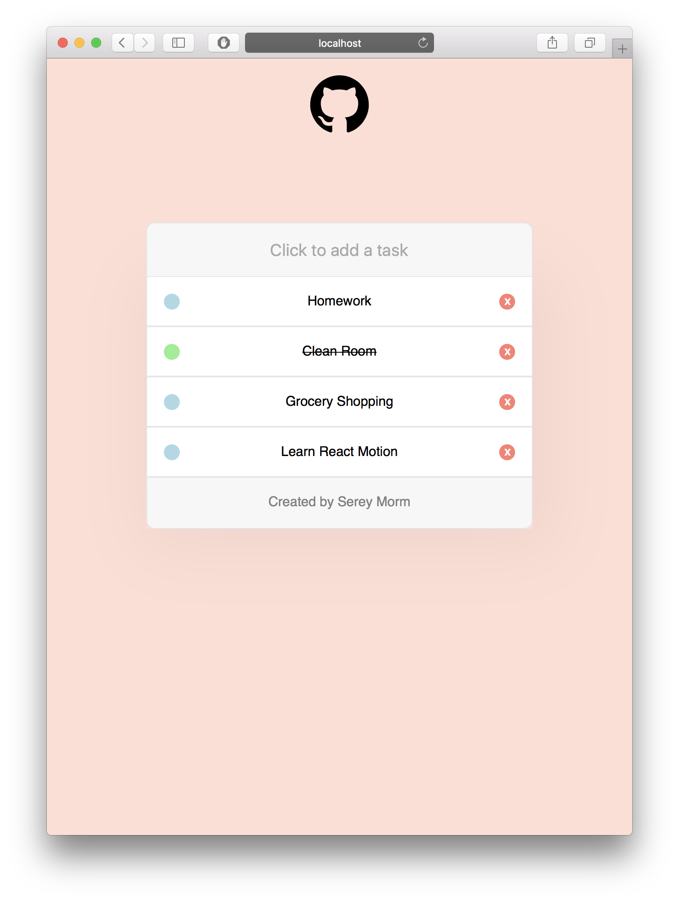

# Lineup
A simple to-do list to learn the core paradigms of [react-motion](https://github.com/chenglou/react-motion) and expand on React and CSS fundamentals.

Currently hosted at http://sereymorm.com/lineup/

### Tools

- [React](https://facebook.github.io/react/), the main front-end library
- [React Motion](https://github.com/chenglou/react-motion), animation library
- [React Media](https://www.npmjs.com/package/react-media), manages media queries in React components

See the repository for the reverse proxy server -> [Here](https://github.com/sMorm/yelpREST)

This project was bootstrapped with [Create React App](https://github.com/facebookincubator/create-react-app).